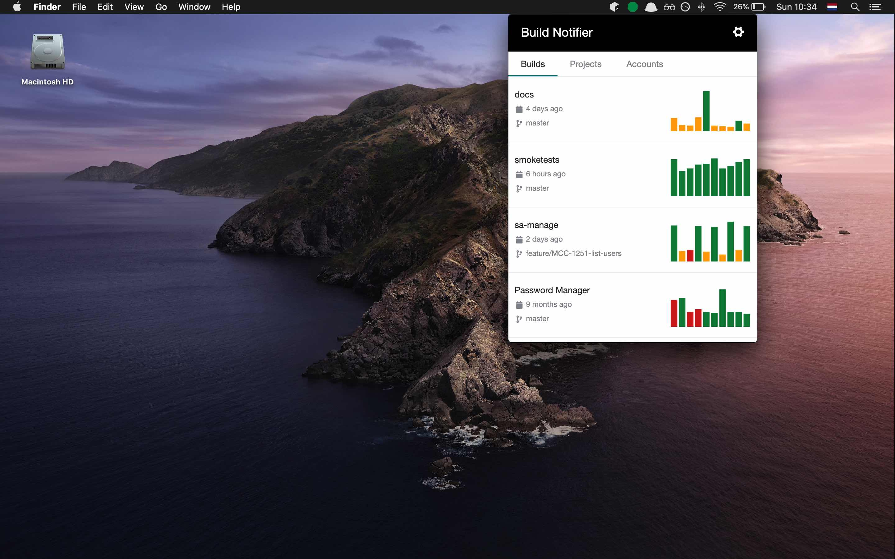

# Build Notifier

[Build Notifier](https://buildnotifier.app/) lets you see your CI/CD results in your taskbar, and gives you control over what information should come through.
It is build with electron, and supports Windows, MacOS and Linux.



You can download the ready-to-run versions from the official site: [https://buildnotifier.app/download.html](https://buildnotifier.app/download.html), 
or you can build your own version from source code. See the scripts section below for more info.

## Authentication
If the CI Service supports the OAuth2 spec, then the 'authorization code' grant is used (e.g. Bitbucket, Github)
If not, the custom authentication of the CI service is used (e.g. CircleCI)

For the authorization code flow, a separate back-end service is used. (Different repository)

## Roadmap

There is currently no roadmap.
Feedback is highly appreciated.

## Technical background info
This repository started from an electron-starter-template, namely the `electron-webpack-quick-start`:
> A bare minimum project structure to get started developing with [`electron-webpack`](https://github.com/electron-userland/electron-webpack)

Thanks to the power of `electron-webpack` this template comes packed with...

* Use of [`webpack-dev-server`](https://github.com/webpack/webpack-dev-server) for development
* HMR for both `renderer` and `main` processes
* Use of [`babel-preset-env`](https://github.com/babel/babel-preset-env) that is automatically configured based on your `electron` version
* Use of [`electron-builder`](https://github.com/electron-userland/electron-builder) to package and build a distributable electron application

Make sure to check out [`electron-webpack`'s documentation](https://webpack.electron.build/) for more details.

This repository uses `yarn` for package management (as is the default for most electron-apps)

## Development scripts
Copy the `.env.example` to a new `.env` file (gitignored) and add your own environment variables.

```bash
# install dependancies
yarn

# run application in development mode
yarn dev

# compile source code and create webpack output
yarn compile

# `yarn compile` & create build with electron-builder
yarn dist:mac
yarn dist:win
yarn dist:linux

# `yarn compile` & create unpacked build with electron-builder
yarn dist:dir
```
